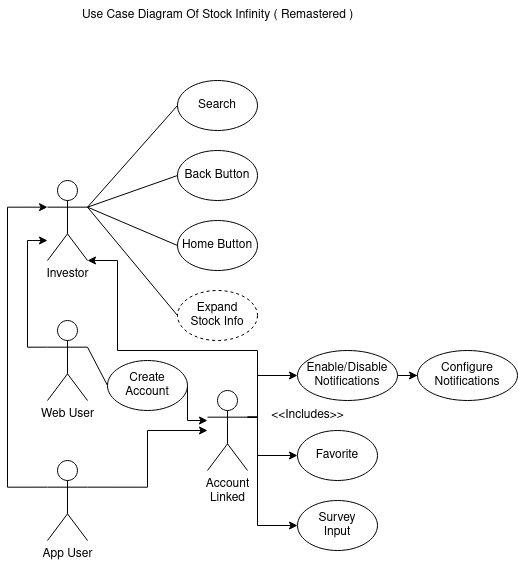

# Requirements

Group 01 - "[Stock Infinity]"
Date: October 2nd, 2022
Group Members: Joshua Heinz, David Knight, Jack Shanley, Alex Poole, Preston Lee, Nate Chan

## 1. Positioning

### Problem Statement 1.1

It is difficult to find a financial application that is not littered with unnecessary information. Many of the current stock application powerhouses have had incidents in which they were exposed for ingenuine practices which have large impacts on an investor’s financial well being.

### Product Position Statement 1.2

For those who need honest and uncluttered information about their favorite stocks, Stock Infinity can bridge the gap that larger firms and companies have been incapable of providing. Our product offers a friendly interface that allows you to see the information that you need without the extra fluff. You can be confident that our product will deliver the information you need for your financial future without fail.

### Value Proposition 1.3

A simple, honest, and comprehensive application that allows both novice and expert investors to view information on their preferred stocks without having to sift through unnecessary information or worry about conflicting interests of shareholders affecting their access to information.

## 2. Stakeholders

## 3. Functional requirements

## 4. Non-functional requirements

**Function Stability** - The App/Website should be running 100% of the time, hyperlinks and buttons should constantly be working once the website is launched.

**Performance Efficiency** - The App/Website should run smoothly. 8/10 users will enjoy the website’s smoothness and ability to be upheld.

**Compatibility** - The App/Website will be cross compatible with all devices. 100% of users will be able to access from all devices that can search for websites.

**Usability** - The App/Website will be easily accessible and pleasing to the user. 8/10 users will be happy with the setup of the site.

**Reliability** - The website will be frequently updated to ensure it’s always reliable. The website should be up 100% of the time once launched.

**Security** - The website will have a login entry to ensure security. 9/10 users will never have security issues.

**Maintainability** - The website will be easy to access, navigate, and will be updated frequently to keep up to date on the best software available. 8/10 users will be able to navigate our website with ease.

**Portability** - App/Website should be able to be used on all devices including mobile. 100% of users will be able to access from all devices.

## 5. MVP
Designing a minimum viable product for a stock tracker app will require only the necessary functionality while still satisfying the requirements for this product. Firstly, an app icon and name will be established.  As for a user interface, the app will have a basic set of features our whole app is based around. The features that will be included are the following: a search bar where investors will search for stocks, the ability to favorite a stock and add it to your list of stocks being tracked, a filter to set at what price jump and/or decrease to be notified at, and a place to view the users favorited stocks and their relative data. These basic features will be the foundation to validating our product. To achieve this we will conduct user studies in which the users will test our MVP for a few days. In these few days they will eventually search for a few desired stocks to track, favorite them, set their preferred notification settings, and then proceed to evaluate whether the stock updates given were helpful with monitoring their favorite stocks by performing a survey after their usage. The feedback for our MVP will allow us to get a better understanding of the value of our product and benefit us in creating the most optimal stock tracker app. 

## 6. Use Cases

### 6.1. Use Case Diagrams
****

### 6.2. Use Case Descriptions

**Use Case**: Download App\
**Actor**: Investor (app user)\
**Description**: A smartphone user will download the “Stock Infinity” app to sign up for the service.\
**Preconditions**: They own a smartphone.\
**Postconditions**: They have the app and have created an account.\
**Main Flow**:
1. The actor logs into the Google Play store and downloads “Stock Infinity”.
2. After installation, the user opens the app, and follows the steps to create an account.
**Alternative Flow**:
3. We create a web app, users will access the app via a link.

**Use Case**: Receive Push Notifications\
**Actor**: Investor (app user)\
**Description**: The user will receive price notifications on their phone.\
**Preconditions**: The user has downloaded the “Stock Infinity” app and created an account.\
**Postconditions**: The user is now receiving basic non customized notifications.\
**Main Flow**:
1. After downloading the app, the user gives their phone permissions to send the phone notifications.
**Alternative Flow**:
2. The user does not give their phone permission to send them notifications.
3. They must open their settings, go to the notifications settings page, and then allow the phone to give them notifications.
4. If they do not follow step 2, then they will not be able to use the service. Permission must be given to the phone.

**Use Case**: Customize Notification Type\
**Actor**: Investor (app user)\
**Description**: The user can select the types of price notifications they want to receive.\
**Preconditions**: The user has either signed up via the “Stock Infinity” app or the web app.\
**Postconditions**: The user is not only receiving notifications, but notifications that they customize.\
**Main Flow**:
1. The user logs into the application on their phone.
2. They open the setting that allows them to select and deselect the types of notifications they want to receive.
3. They go through the list and customize what notifications they want to receive.
**Alternative Flow**:
4. The user logs into their account online via the web app.
5. They open the setting that allows them to select and deselect the types of notifications they want to receive.
6. They go through the list and customize what notifications they want to receive.
**Alternative Flow**:
7. The user does not change any settings regarding what kind of information they want to receive, and will continue to receive the default price notifications.

**Use Case**: Stay Informed Of Price Changes\
**Actor**: Investor (app user)\
**Description**: The end result, which is that the user receives notifications that help them stay informed of price updates of their preferred stocks.\
**Preconditions**: The user has either signed up for “Stock Infinity” via the web app to receive notifications, used the “Stock Infinity” app to sign up, or both.\
**Postconditions**: The user will be receiving notifications that let them stay up to date on price updates.\
**Main Flow**:
1. The user receives push notifications.
2. They respond to the information as they desire.

**Use Case**: Expand Stock Info\
**Actor**: (app user)\
**Description**: The user will have the ability to expand the information of the stock their viewing.\
**Preconditions**: The user has access to the Stock Infinity application and has signed up for the app; allowing them the ability to search for stocks and view info about it.\
**Postconditions**: The user will be able to view more information about the stock they are currently tracking.\
**Main Flow**:
1. The user will log into the Stock Infinity application from the web platform or the mobile platform.
2. The user will navigate to the search function provided by the application.
3. The user will search for the stock that they want to read about.
4. The information regarding the stock will be presented to the user.
5. The user will select the “expand information” feature.
6. More information will be displayed to the user.

**Alternative Flow**:
None.

**Use Case**: Home Button
**Actor**: Investor
**Description**: The investor would be able to go directly back to the main screen regardless of current location. 
**Preconditions**: The investor has access to the Stock Infinity application via app or web. 
**Postconditions**: The investor would be back at the main screen where their stock list is.
**Main Flow**:
1. The investor starts on the main screen, and goes to another in depth tab, however far in.
2. The investor presses the home button to conveniently get back to the main screen

**Use Case**: Back Button
**Actor**: Investor
**Description**: The investor would be able to go back to the screen before to prevent the hassle of restarting their current path from the main screen.
**Preconditions**: The investor has access to the Stock Infinity application via app or web. 
**Postconditions**: The investor would be back on the screen before.
**Main Flow**:
1. The investor starts on any screen and goes to another in depth tab.
2. The investor presses the back button to conveniently get back to the screen prior.
**Alternative Flow**:
3. If the investor is on the main screen already and presses the home screen again, or just started the app, the path is wiped.
Since the path is wiped, the back button would be unresponsive. 
 
**Use Case**: Search
**Actor**: Investor
**Description**: The investor would be able to look up different stocks to choose from based on name, or other heuristics as deemed fit from the survey. 
**Preconditions**: The investor has access to the Stock Infinity application via app or web. 
**Postconditions**: The investor would have a list of stocks to look further into.
**Main Flow**:
1. The investor searches by some heuristic.
2. The investor can now interact with the stocks presented
**Alternate flow**:
3. The investor searches for something that isn’t known and is greeted by a can’t be found screen.

**Use Case**: Survey Input
**Actor**: Account Linked
**Description**: The Linked Account would be able to give feedback to the developers on what they feel is missing, or if something should be changed. 
**Preconditions**: The investor has access to the Stock Infinity application via app or web, and the investor is using a linked account. 
**Postconditions**: The linked account would have put their input in on what could be done to better the application.
**Main Flow**:
1. The linked account has used the application for a while and is prompted to answer a short optional survey and accepts the invite.
2. The linked account puts their feedback in and it gets sent to the developers/ stored
**Alternate flow**:
3. The linked account denies the short survey and gets returned to wherever they were.

## 7. User stories

**User Story 1**: "As a frequent stock trader, I want a built community so that I’m trading with peers rather than sharks."

**User Story 2**: "As a new stock trader, I want a visually appealing interface so that I can get into trading without having to rely on apps that look bad."

**User Story 3**: "As a long term stock trader, I want to view these stocks over a period of time so that I can monitor my investments since the time I purchased them."

**User Story 4**: "As a beginner trader, I want to be able to receive notifications on my favorite stocks so that I can easily monitor them in one location."

**User Story 5**: "As a long time stock trader, I want to be able to connect the change in a stock with a reason from a news article so I can understand the full picture. ( Both positive and negative changes )"

**User Story 6**: "As a long time stock trader, I want to be able to match up data with prior trends so I can have a somewhat accurate estimate of where the stock can go in the future. ( linked with article reasoning )"

**User Story 7**: "As a finance professional, I want to have access to the trading volume and market cap for a stock so that I can help my clients make informed financial decisions."

**User Story 8**: As a college student, I want to have an easy and approachable interface so that I can check my stock information quickly and efficiently."

**User Story 9**:  “As a beginner trader, I want to have the ability to set a filter for how often I receive notifications so that I’m not not being bombarded with information.”

**User Story 10**: “As an experienced trader, I want to be able to see relevant information about the stock such as it’s market cap and price to earning ratio (P/E ratio) so that I can get an insight on what stocks I’m looking to track”

**User Story 11**:

**User Story 12**:

## 8. Github Issues
