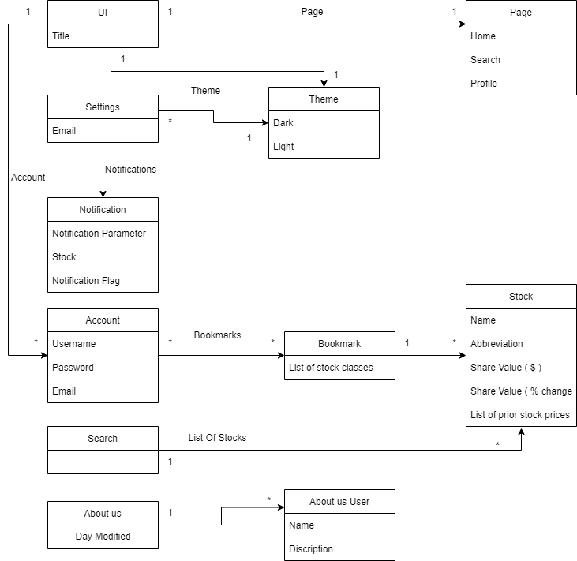

# Analysis

## 1. System Description

### Introduction
StockInfinity aims to provide transparent _stock_ information to users through multiple platforms to deliver a seamless experience and an exceptional level of accessibility. It is difficult to find a financial application that is not littered with unnecessary information. Many of the current _stock_ application powerhouses have had incidents in which they were exposed for ingenuine practices which have large impacts on an investor’s financial well being. For those who need honest and uncluttered information about their **favorite** _stocks_, Stock Infinity can bridge the gap that larger firms and companies have been incapable of providing. Our product offers a friendly interface that allows you to see the information that you need without the extra fluff. You can be confident that our product will deliver the information you need for your financial future without fail. A simple, honest, and comprehensive application that allows both novice and expert investors to view information on their preferred _stocks_ without having to sift through unnecessary information or worry about conflicting interests of shareholders affecting their access to information.

### Create Account
The ability to create/log into an account for this application is valuable for those who want to save their progress in bookmarks and notifications. To store this information, the **account** would be its own class with the _Username_, _Email_, _Password_, class with **favorites**, and a class with **notification settings**. Within the **bookmark** would be a _list of stock classes_, while within the **notification** classes would be the _stock_ along with the _conditional_ for when to post it. This configuration of classes within classes would provide a framework that is easier to add and edit into. 

### View Stocks
The user should be able to easily access the various pieces of information about a **stock**. This information will include key data points such as the _trading volume_, _market cap_, _average trading volume_, and the _beta_ for that **stock**. These pieces of information will be easily accessible and constantly updated with the correct information. For this requirement, the **stock(s)** is the class and the various types of data for each **stock** are the attributes. The <u>preferred stocks</u> would be an association to the general **stock** class. These will be described in more detail shortly.

### UI
The **UI** will feature a simple layout with minimal screen changes. There will be a _navigation bar_ featured at the bottom of the **screen** allowing users to switch between the three different **screens**.  viewing their *home page* of featured **stocks**, a **screen** for _searching_ for **stocks**, and a **screen** to view your _profile_ and change your **settings**. The featured **stocks** would include the highest traded **stocks** (on the day) until the user begins to favorite **stocks**. The _search_ **screen** will let users look for different **stocks** to view their information and favorite them. The _profile_ screen will house the users **account** information, as well as let the user adjust **accounts** and change **notification** settings.

## 2. Model
****
