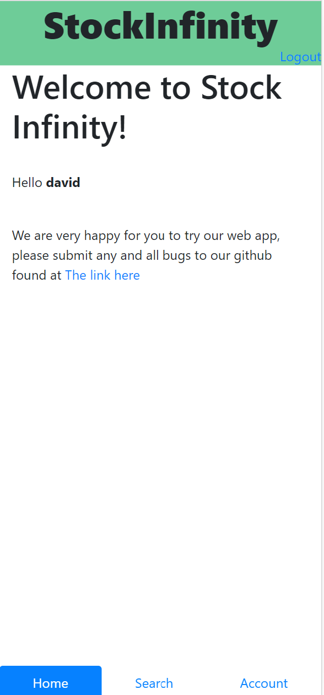
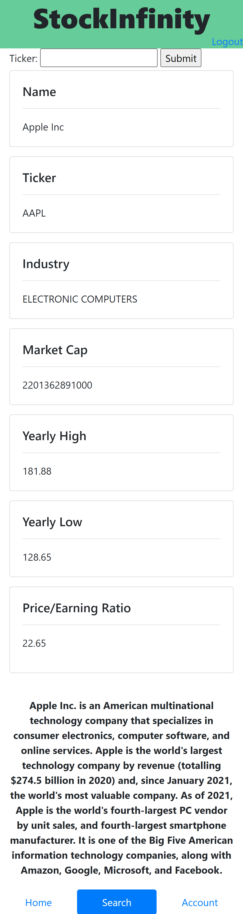
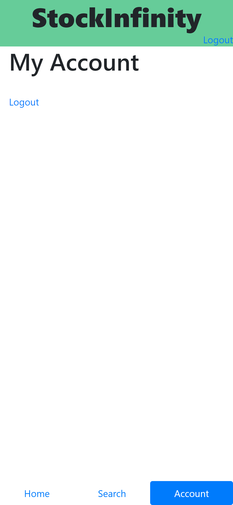

# Implementation 1

## 1. Introduction

StockInfinity aims to provide transparent _stock_ information to users through multiple platforms to deliver a seamless experience and an exceptional level of accessibility. It is difficult to find a financial application that is not littered with unnecessary information. Many of the current _stock_ application powerhouses have had incidents in which they were exposed for ingenuine practices which have large impacts on an investor’s financial well being. For those who need honest and uncluttered information about their **favorite** _stocks_, Stock Infinity can bridge the gap that larger firms and companies have been incapable of providing. Our product offers a friendly interface that allows you to see the information that you need without the extra fluff. You can be confident that our product will deliver the information you need for your financial future without fail. A simple, honest, and comprehensive application that allows both novice and expert investors to view information on their preferred _stocks_ without having to sift through unnecessary information or worry about conflicting interests of shareholders affecting their access to information. \
https://github.com/davidknight00/finance_app

## 2. Implemented requirements

**Requirement**: As an experienced trader, I want to be able to see relevant information about the stock such as it’s market cap and price to earning ratio (P/E ratio) so that I can get an insight on what stocks I’m looking to track. \
**Issue**: https://github.com/davidknight00/finance_app/issues/33 AND https://github.com/davidknight00/finance_app/issues/31 \
**Pull request**: https://github.com/davidknight00/finance_app/pull/51 \
**Implemented by**: Jack Shanley, Nate Chan, and Preston Lee \
**Approved by**: David Knight 

**Requirement**: As a new stock trader, I want a visually appealing interface so that I can get into trading without having to rely on apps that look bad. \
**Issue**: https://github.com/davidknight00/finance_app/issues/24 
**Pull request**: https://github.com/davidknight00/finance_app/pull/51 \
**Implemented by**: Alex Poole, David Knight, and Josh Heinz \
**Approved** by: Jack Shanley 

**Requirement**: As a socially ethical stock trader, I want the ability to be able to find information regarding particular companies with publicly traded stocks, so that I can make informed decisions about where I invest my money. \
**Issue**: https://github.com/davidknight00/finance_app/issues/29 \
**Pull request**: https://github.com/davidknight00/finance_app/pull/51 \
**Implemented by**: Alex Poole, Jack Shanley, Josh Heinz, and Nate Chan \
**Approved by**: David Knight

## 3. Tests

**Test Framework**: DJango unittest
See our unit testing [here](https://github.com/davidknight00/finance_app/tree/master/stockInfinity/stockInf/tests) \
An example test case that we created was testing that the correct view was being displayed for POST requests. This view can be seen [here](https://github.com/davidknight00/finance_app/blob/master/stockInfinity/stockInf/views.py#L16-L53) and the test for this view can be found [here](https://github.com/davidknight00/finance_app/blob/master/stockInfinity/stockInf/tests/test_views.py#L24-L34) These set of tests ensure that a ticker (such as TSLA) returns the correct html and response code, and tickers that do not exist (such as OMG) return the 404 page. 

****

## 4. Adopted technologies

- **Python**: Python is an easy to read language that can connect to the API, be used in backend, and serve it all to the front end without the need to write much code. By using Python with the Jinja templating language, we can change the views of html based on user validation, the type of request made by the user, 
- **Django**: DJango is a web framework built in Python that aims to create the nessesary stucture so that we as developers can focus on the development of the app.
- **Jinja**: Jinja is a templating language that allows us to insert python code into HTML.
- **SQLite**: This database allows us to keep track of stocks that users have favorited.

## 5. Learning/training

We have people who are good at each, which will allow each member to teach the rest of the team how to develop these adopted technologies. All of us have familiarity with Python which was a great start for us. In order to learn DJango, we felt it would be best if two to three people worked on the initial start of the web app by watching a video and reading the documentation provided by DJango to get a very basic template going. From that point we were able to explain it to the other group members and get everyone caught up. Jinja was the easiest of the technologies to learn as we just needed to add curly braces and python code inside of our html to get it working.

We originally tried a paired programming style for implementing the MVP. The reason we felt we could apply this strategy was because we felt that if we split the work and left it to people to stick to deadlines, one person being late would cause everyone to be late. By meeting at the library, we were able to implement parts of our MVP working together to implement each core peace we felt needed to be there based on the user stories. We felt that based on our strengths, in the coming weeks we should implement team based development but we do not need to do paired programming to be successful now that we have a minimum viable product to look at. Our Front End will work with HTML, CSS, Jinja, while our Back End will work with Python, DJango, and SQLite.

## 6. Deployment

Unfortuneatly, at the time of turning this deliverable in, we failed to deploy the web app for the world to see. We hope to have this working by our next implementation.

## 7. Licensing

**MIT License**

- [MIT license overview](https://choosealicense.com/licenses/mit/)

- [Our License](https://github.com/davidknight00/finance_app/blob/master/LICENSE)

## 8. Readme File

- [Our README](https://github.com/davidknight00/finance_app/blob/master/README.md)
- [Our CONTRUBITING](https://github.com/davidknight00/finance_app/blob/master/contributing.md)
- [Our CODE OF CONDUCT](https://github.com/davidknight00/finance_app/blob/master/CODE_OF_CONDUCT.md)
- [Our LICENSE](https://github.com/davidknight00/finance_app/blob/master/LICENSE)

## 9. Look & feel

During our interviews we found that it’s very common for stock related apps to bombard users with information. We also deemed that our consumer segments mainly consisted of beginner to intermediate investors so we want to be able to stick to an incomplex look and feel. Overall we want StockInfinity to have a clean and simple UI. By implementing a simple design this will make the app more intuitive for users.

****
****
****

## 10. Lessons learned

Overall, we didn't realize how intensive it would be to make so many pulls just to make one graph, let alone multiple. This, along with making a non-static page proved to be unforeseen problems that largely stunted the beginning phase of this project. We would have had more success if we had a smaller MVP, as our MVP seems closer to a finished product than minimum.

## 11. Demo
Link to video: [here](https://youtube.com/shorts/mbZx9SqsiXA?feature=share)
