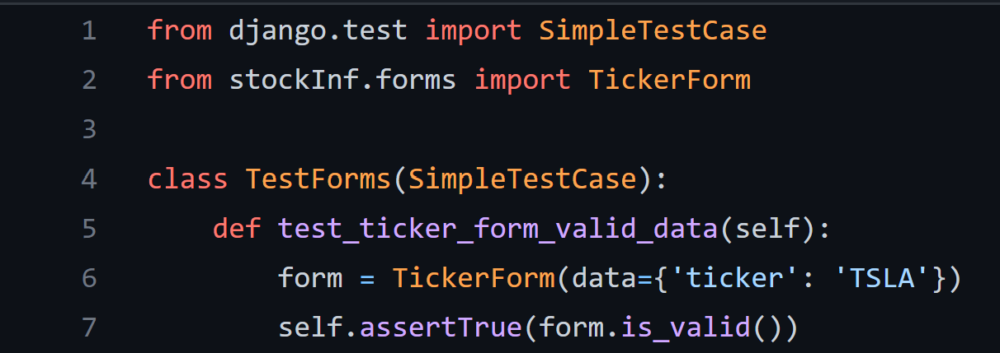
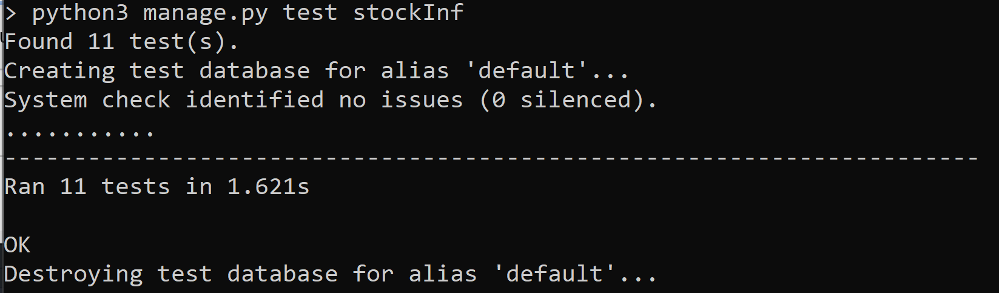

# Verification and Validation

## 1. Description

StockInfinity aims to provide transparent stock information to users through multiple platforms to deliver a seamless experience and an exceptional level of accessibility. It is difficult to find a financial application that is not littered with unnecessary information. Many of the current stock application powerhouses have had incidents in which they were exposed for ingenuine practices which have large impacts on an investor’s financial well being. For those who need honest and uncluttered information about their favorite stocks, Stock Infinity can bridge the gap that larger firms and companies have been incapable of providing. Our product offers a friendly interface that allows you to see the information that you need without the extra fluff. You can be confident that our product will deliver the information you need for your financial future without fail. A simple, honest, and comprehensive application that allows both novice and expert investors to view information on their preferred stocks without having to sift through unnecessary information or worry about conflicting interests of shareholders affecting their access to information.

While StockInfinity is still in its early development stages, our web application is available to select any and all users for local testing. This web app features a simple user interface with user experience as a main focal point, the ability to search for any publicly traded stock within the U.S., and the ability to favorite stocks after creating an account. User profiles allow us to control notification timing, whether that be based on daily notifications or price updates on a selected interval. No longer do we need to rely on biased information! Now, everyone can find unbiased information on the stocks that they want to purchase.

Project repo: [Github link to StockInfinity](https://github.com/davidknight00/stockInfinity)

## 2. Verification

### 2.1 Unit Test

#### 2.1.1
We used unittest, a built in library for Python to conduct our unit testing. 

#### 2.1.2
View our unit tests [here](../stockInfinity/stockInf/tests)

#### 2.1.3
****
Here we are testing our form class to ensure that the form returns a valid input for a known U.S. publically traded stock's ticker. You can find the class [here](../stockInfinity/stockInf/forms.py) and test file [here](../stockInfinity/stockInf/tests/test_forms.py#L4-L7)

#### 2.1.4
The result of running the unit tests can be seen in the image below:
****

### 2.2 Acceptance Test

#### 2.2.1
We used the Selenium framework for Firefox and Chrome.

#### 2.2.2
View our acceptence tests [here](../stockInfinity/stockInf/tests/acceptance)

#### 2.2.3
Here we are testing our login feature by ensuring that the test user successfully logs in and logs out. Check out the test [here](../stockInfinity/stockInf/tests/acceptance/stockInfinityTests.side)

#### 2.2.4
The result of running the acceptance test can be seen in the image below:
****

## 3. Validation/User Evaluation

### Script
**Q:** Look around and explore the different tabs on the bottom. How do you feel about the overall look of the app? What can be improved upon? \
**Q:** Let's look at the search screen in depth, how do you feel about the presentation of a stock being present? Would you prefer a standard search screen before seeing stock information? \
**Q:** How do you feel about the information presented in the search menu? Is there more information about the stocks that you want to see? \
**Q:** How do you feel about the relevency of the stories? How do you feel about the quantity? Are there any changes that you wish to see? \
**Q:** Do you have any suggestions to improve the app?

### Results
* The pages feels bare. There could be more content or even a logo of some kind. Overall the app is user-friendly and everything is easy to find.
* Some were fine with the current stock being present on the first load. Others would prefer a dedicated screen for the first time you pull up search.
* Overall the feedback was good on the information. It was displayed nicely but lacked a branding of sorts. More experienced traders wanted to see some type of graph to represent trading history. 
* The stories seemed fine but some individuals would like the option to either load more stories, or have more stories than just 3 present. 
* Some design suggestions releveant to branding were discussed but nothing as far as functionality outside of what was discussed.

### Reflection
Users who created an account were able to do so seamlessly. The screen to do so should be styled more but it serves its purpose for the first version. The search feature works well but users wanted to see a graph present in addition to the extra information. The users quickly found out about the 5 searches per minute limitation of the API even in our atempts to stall the users at times. They were not a big fan of this but were understanding of it. The system needs to have the requirements worked outas some users struggled to get it running locally. This seems to be due to a dependency error in the requirements.txt which has now been fixed.
